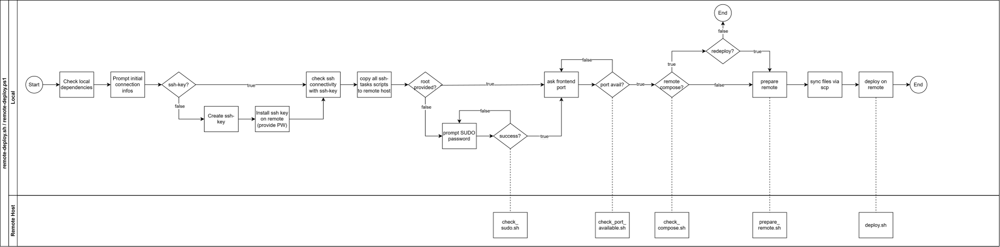

# Remote Deployment Notes

Use `./deploy-remote.sh` (macOS/Linux/WSL/Git Bash) or `deploy-remote.ps1` (PowerShell) from this directory.

After a successful deploy, you may still need manual steps on the host:
- open the frontend port in your firewall/iptables
- update Plesk to route the domain to the frontend (see screenshots)

## Logs
Logs are stored in `deploy/logs`. Re-run the script any time to redeploy.

## Example iptables (allow TCP 8080):
```bash
# allow incoming traffic on port 8080
sudo iptables -A INPUT -p tcp --dport 8080 -j ACCEPT
# allow established/related connections
sudo iptables -A INPUT -m conntrack --ctstate ESTABLISHED,RELATED -j ACCEPT
# allow loopback traffic
sudo iptables -A INPUT -i lo -j ACCEPT
```

## Example plesk configuration
1. Select 'Proxyregel für docker' / 'Proxyrules for docker'


2. Select 'Regel hinzufügen' / 'Add rule'


3. Leave url as it is, select the 'frontend' container, select the correct port (same port as used in the deploy-remote script)


## Documentation Under the Hood
The deployment flow follows the structure provided in the following svg. 


## 1. Initialization and Local Pre-Checks (Local Host)
The deployment process starts locally. All required dependencies are checked, and basic initializations are performed before establishing a connection to the remote host.

## 2. Interactive Collection of Credentials and Configuration Parameters (Local Host)
The user is prompted locally to enter the necessary login credentials and configuration parameters. These serve as the basis for the later configuration on the remote host.

## 3. Creation and Management of SSH Access (Local Host)
If no SSH key exists, it is automatically generated and used for authentication. Afterwards, the SSH connection to the remote host is validated.

## 4. Transfer of Remote Scripts
The remote server executes Bash scripts for each step. The advantage is that the same remote scripts can be reused in both local scripts (Bash and PowerShell). In this step, the scripts are copied to the server.

## 5. Connection Testing and Permission Validation (Local Host)
Before the actual deployment begins, the script checks whether the necessary permissions are available. If required, the SUDO password is requested to enable the initial configuration.

## 6. Generation of the Configuration File `.env.deploy`
Next, the user is asked for the deployment parameters (Frontend port, Postgres user, Postgres password). Besides previous permission checks, this step also validates port availability and existing APT packages. If the frontend port is already in use on the remote host, the user is prompted again.

## 7. Initialization of the Remote Deployment (Remote Host)
In this step, the script `prepare_remote.sh` is executed on the remote host. It installs all required packages (Docker, Docker Compose, etc.).

## 8. File Synchronization
All application files and Docker-related files are copied to a working directory on the remote host.

## 9. Docker Compose: Down, Build & Up
The final step builds and starts the Docker containers. At the end, the user receives an overview with relevant information (URL, log files, remote files, etc.).

## 10. Shutdown (Post-Process & Manual)
With the command-line parameter `--shutdown`, the user can run the script to shut down the deployment. Up to step 5, the process follows the same flow as before. Afterwards, the script `shutdown_remote.sh` is executed on the remote host, resetting the application and server state to the initial condition.

