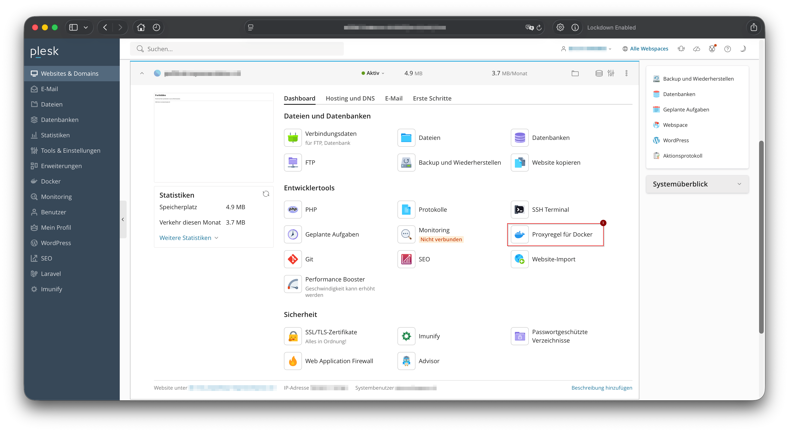
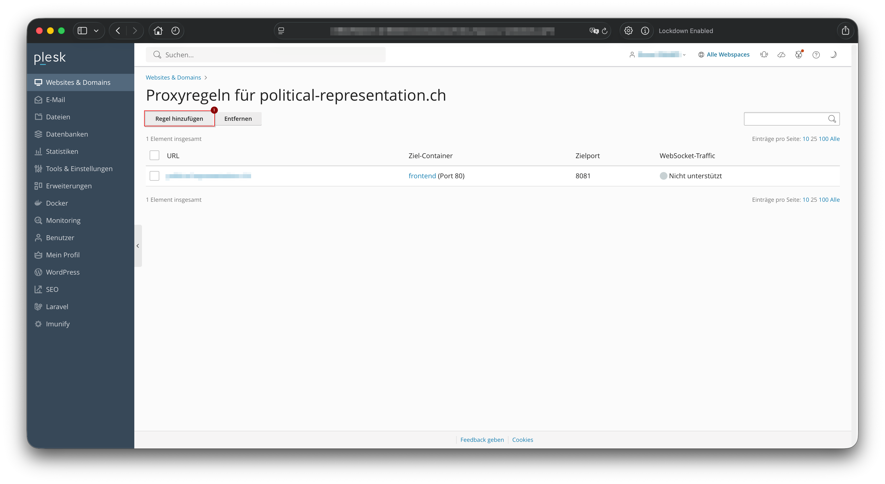
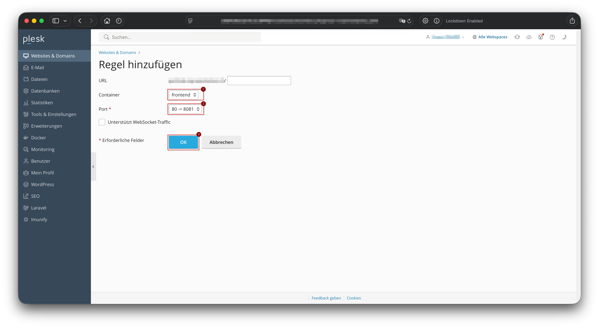

# Remote Deployment Notes

Use `./deploy-remote.sh` (macOS/Linux/WSL/Git Bash) or `deploy-remote.ps1` (PowerShell) from this directory.

After a successful deploy, you may still need manual steps on the host:
- open the frontend port in your firewall/iptables
- update Plesk to route the domain to the frontend (see screenshots)

## Logs
Logs are stored in `deploy/logs`. Re-run the script any time to redeploy.

## Example iptables (allow TCP 8080):
```bash
# allow incoming traffic on port 8080
sudo iptables -A INPUT -p tcp --dport 8080 -j ACCEPT
# allow established/related connections
sudo iptables -A INPUT -m conntrack --ctstate ESTABLISHED,RELATED -j ACCEPT
# allow loopback traffic
sudo iptables -A INPUT -i lo -j ACCEPT
```

## Example plesk configuration
1. Select 'Proxyregel für docker' / 'Proxyrules for docker'


2. Select 'Regel hinzufügen' / 'Add rule'


3. Leave url as it is, select the 'frontend' container, select the correct port (same port as used in the deploy-remote script)

